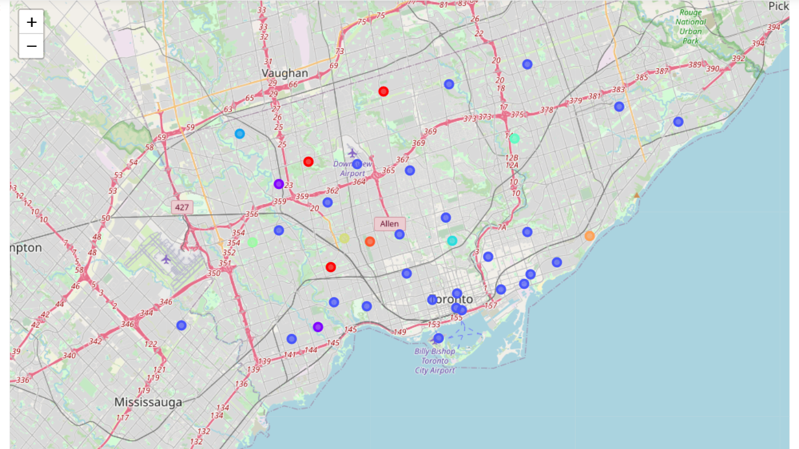

# Neighbourhood Analysis of Toronto

## Dependencies

## Introduction

Suppose you want to shift somewhere else in the city beacause you got a new job at the other end of the city but you like your current neighbourhood beacuse of the facilities avialble nearby. What'll you do then? To solve this problem I've used the concept of clustering, and clustered the neighbourhoods based on their popular nearby venues as shown in the images below. 

|||
|---|---|

Now you can choose where you should shift your resident to so that you have to travel minimum for work while getting the same facilities as your previous neighbourhood. I've used the city of `Toronto`, but this method can be applied to any city. 

See the code here [part 1](Neighborhood_Analysis_of_Toronto_1.ipynb), [part 2](Neighborhood_Analysis_of_Toronto_2.ipynb).

**Note : Folium maps are not loading on github. To see the maps you have to run the notebook on your preferred environment and don't forget to make the notebook `Trusted`.**

## Thanks for Reading :)