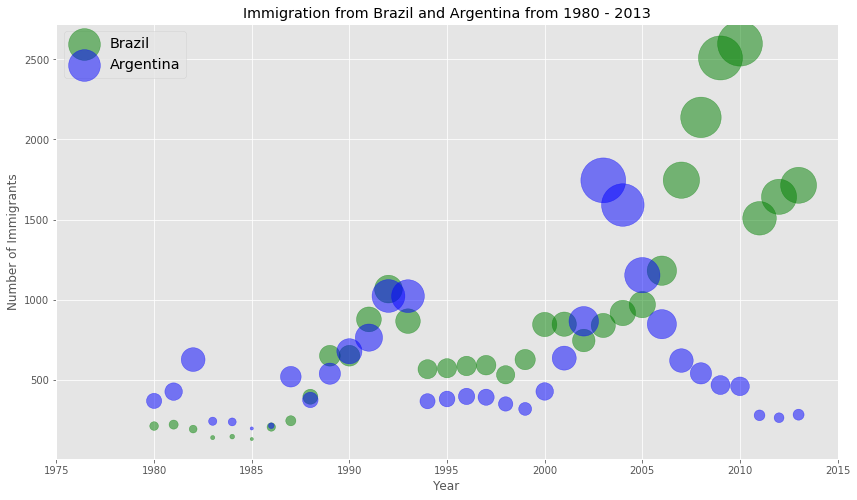
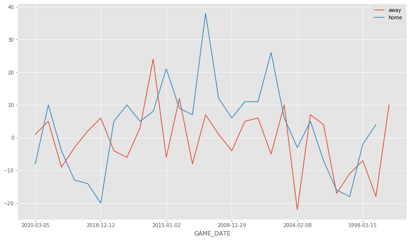
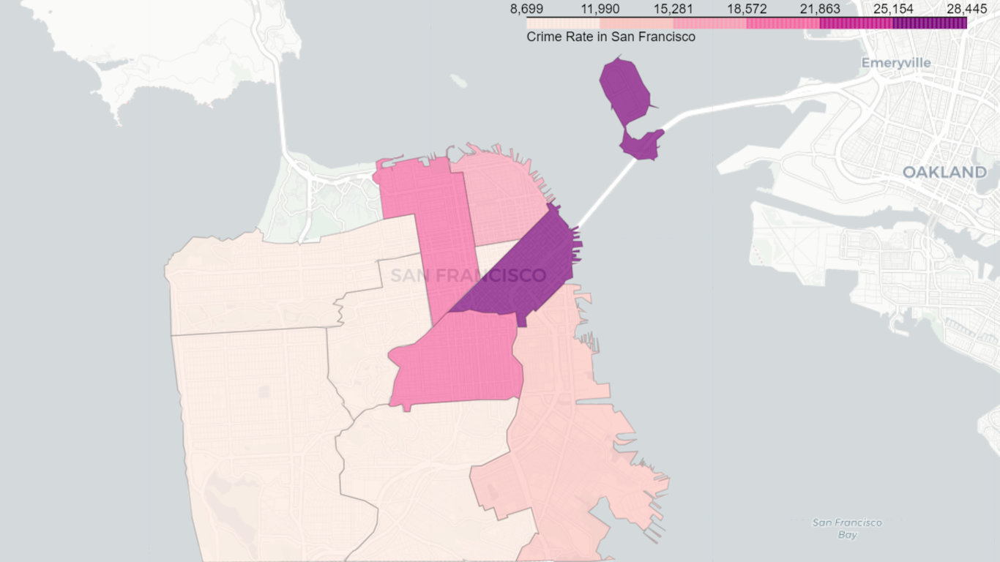
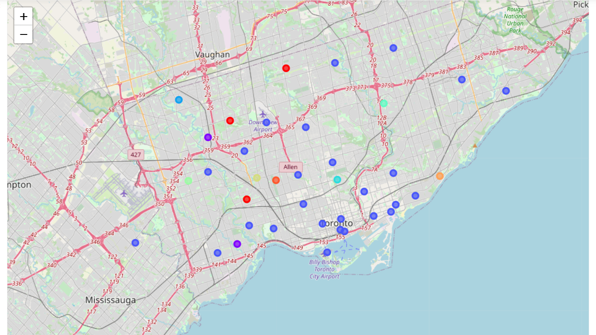
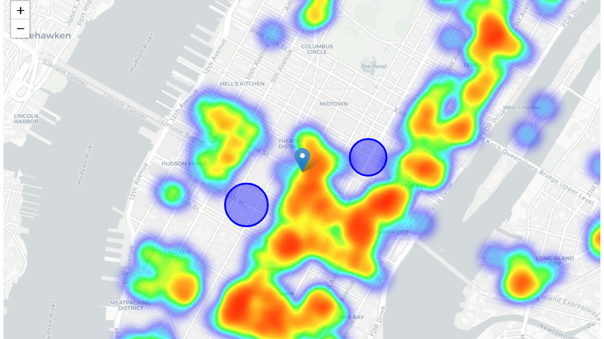
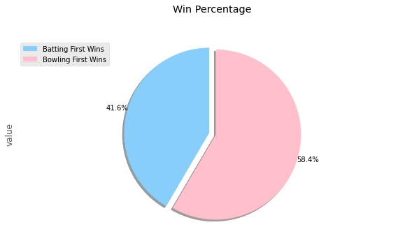

	

	
	
	
	
	
	
	

## About the Repo

This repository contains some projects (mostly mini-projects) related to data science and analysis. Following are the links for the same.

<h3>

	
 Great Depression of Argentina

	<table>
		<th><a href="Main/Argentina">Visit Directory ↗</a></th>
		<th></th>
	</table>

</h3>
<h3>

	
 Analysing BasketBall Performance

	<table>
		<th><a href="Main/Basketball">Visit Directory ↗</a></th>
		<th></th>
	</table>

</h3>
<h3>

	
 Crime Analysis of Sanfrancisco

	<table>
		<th><a href="Main/Sanfrancisco">Visit Directory ↗</a></th>
		<th></th>
	</table>

</h3>
<h3>

	
 Neighbourhood Analysis of Toronto

	<table>
		<th><a href="Main/Toronto">Visit Directory ↗</a></th>
		<th></th>
	</table>

</h3>
<h3>

	
 Locations to Open an Indian Restaurant in NewYork

	<table>
		<th><a href="Main/NewYork">Visit Directory ↗</a></th>
		<th></th>
	</table>

</h3>
<h3>

	
 IPL Exploratory Data Analysis

	<table>
		<th><a href="Main/IPL">Visit Directory ↗</a></th>
		<th></th>
	</table>

</h3>

## Thanks for Reading :)

[MIT License](LICENSE) Copyright (c) 2021, 

Author - [Tarun Kamboj](https://github.com/Tarun-Kamboj).